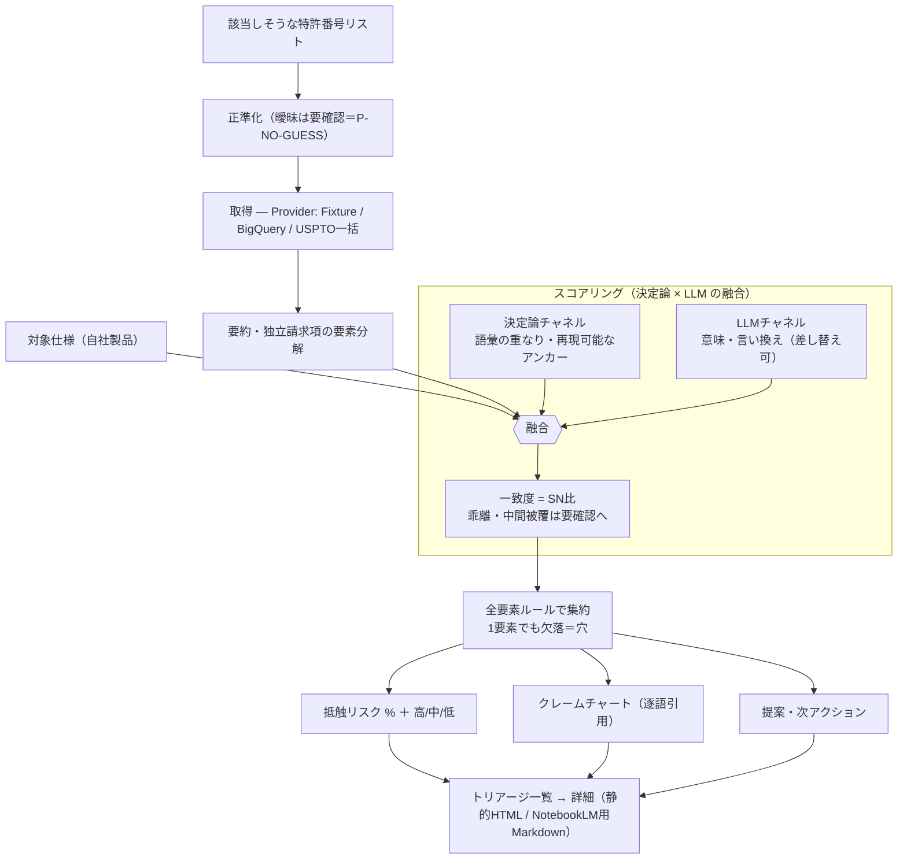

# patent_system — AI自走前提の特許調査支援システム

別システム等から流入する「該当しそうな特許番号リスト」を入力に、公開特許を自動取得し、
要約・比較表・継続監視レポートを極力人手なしで生成する基盤。
**自社仕様に対する抵触リスクを %（高/中/低）でスコアリングし、根拠を逐語引用した
クレームチャート（対比表）と推奨アクションまで出す**ので、特許担当者は一覧を上から
さばくだけでスクリーニングできる。

- 要件定義：[patent_ai_requirements_revised.md](patent_ai_requirements_revised.md)
- **設計（批判的レビュー反映済み）：[docs/architecture.md](docs/architecture.md)** ← まずこれ
- **決定論パイプライン化＋自校とワークフロー化の解説：[docs/workflow.html](docs/workflow.html)**（ブラウザで開く）

---

## このシステムでできること（30秒で把握）

入力＝「該当しそうな特許番号リスト」＋「自社仕様（製品の説明）」。出力＝**特許1件ごとの
抵触リスク%とトリアージ一覧**、各特許の**クレームチャート（請求項要素↔仕様の逐語引用）**、
そして**提案（次アクション）**。○/✗の二択ではなく、根拠付きの%で優先順位が即つく。

| やりたいこと | このシステムの答え |
|---|---|
| 大量の特許をパッと選別したい | **抵触リスク%の高い順に並ぶトリアージ一覧**（高/中/低の三色・要確認キュー） |
| どこがどう引っかかるのか見たい | **クレームチャート**で請求項要素↔仕様の対応記載を横並び、**一致語を両側ハイライト** |
| 判断を信用できる形にしたい | 値は**決定論チャネル × LLMチャネルの融合**、**両者の一致度＝SN比**が信頼幅になり、乖離は自動で「要確認」 |
| AIの作文（ハルシネーション）が怖い | 根拠は**仕様本文の逐語引用のみ**（生成文を足さない）。引用が本文の部分文字列であることを機械保証 |
| 次に何をすべきか知りたい | **提案**：欠落＝防御/設計回避の起点、部分一致＝解釈確認、高カバー＝精査誘導（各々に逐語引用の根拠） |

### どう動くか（パイプライン）



**設計の肝**：1本の数字に混ぜ込まず、再現可能な**決定論チャネル**（語彙の重なり＝高精度のアンカー）と
**LLMチャネル**（意味・言い換えを拾う＝リコール）を分けて持つ。両者の**一致度がそのまま SN比**になり、
一致すれば%を信頼（信頼幅が狭い）、乖離すれば自動で「要確認」に落ちる。集約は **FTO の全要素ルール**
（請求項は全要素を満たして初めて文言侵害）に従い、1要素でも明確に欠落すればリスクは大きく下がる。
LLMチャネルは `Judge` プロトコル経由で**鍵不要のヒューリスティック**と差し替え可能（本番はエージェントが黒子で務める）。

### 試す（鍵ゼロ・1コマンド）

```bash
# 5件のサンプル特許 × サンプル自社仕様 で、トリアージ一覧＋クレームチャート＋提案を生成
py scripts/build_site.py samples/demo_numbers.csv --source fixture \
   --fixtures-dir samples/demo_fixtures --spec samples/target_spec_SAMPLE.md
# → site/index.html を http.server で開く（file:// は不可）:
py -m http.server --directory site
```

成果物：`site/index.html`（トリアージ一覧）→ 各特許の詳細（スコアパネル＋対比表＋提案）。
Markdown（NotebookLM向け）が要るなら `py scripts/run_pipeline.py ...（同じ引数）` → `outputs/report.md`。

### 番号リストが無い？ — 調査（検索）から始める（M8・鍵ゼロ）

番号リストを「もらう」のではなく、**検索ブリーフ（概念キーワード×CPC×期間）から自分で見つける**：

```bash
# 1. 検索ブリーフ → BigQueryコンソールに貼れるSQLを生成（概念内OR・概念間AND）
py scripts/search_patents.py samples/search_query_SAMPLE.json
# 2. コンソールでSQL実行 → 結果をJSON保存 → ランク付け（逐語根拠・ファミリー集約）
py scripts/search_patents.py samples/search_query_SAMPLE.json --from-export <結果.json>
# → outputs/candidates.csv（build_site.py / run_pipeline.py の入力形式）
# → outputs/search_report.md（サーチ式記録＝再現可能な調査ログ）
# → outputs/fetch_records.sql（候補番号の全文取得SQL・claims込み）
# 3. FTOスコアリングへ渡すときは fetch_records.sql の結果JSONを使う
#    （検索SQLはコスト節約でクレーム本文を取らないため、検索の結果JSONを
#      そのまま --export に渡すとクレームが空になりスコアが出ない）
py scripts/build_site.py outputs/candidates.csv --source bq-export \
   --export <fetch結果.json> --spec <自社仕様>
```

ランキングは**二チャネル**：決定論（タイトル/要約/CPCのアンカー採点＋逐語スニペット）×
意味（TF-IDFコサイン・鍵ゼロ既定、`--semantic azure|github` でAPIエンベッダに差し替え可）。
概念の取りこぼしやチャネル乖離は `needs_review` で要確認に落ちる——スコアリングと同じP-NO-GUESS。
ブリーフの `report_type`（`prior-art` / `fto` / `sdi`）で調査様式に応じた枠組み文に変わる。

### 生きている特許か？ — 法的状態（M9）

失効・満了・取消の特許はFTOの障害にならない。`--legal` で法的状態を付与すると、
死亡イベントの**逐語根拠つき**で除外候補に落ちる（根拠が無ければUNKNOWN＋要確認——
存続を推測しない）：

```bash
py scripts/build_site.py outputs/candidates.csv --source ... --spec <自社仕様> \
   --legal fixture --legal-file samples/legal_status_SAMPLE.json   # 鍵ゼロ
# 実データは EPO OPS（developers.epo.org で無料登録 → OPS_CONSUMER_KEY/_SECRET）:
#   --legal ops
```

### 同じサーチ式を定期実行して新着だけ追う — SDI監視（M11）

```bash
py scripts/sdi_monitor.py samples/search_query_SAMPLE.json --from-export <結果.json>
# 1回目 = 初回ベースライン。2回目以降 = 新着のみ outputs/sdi_<テーマ>.md に報告
# （新着ゼロは「変更なし」を明示）。状態は monitor_state/sdi/<テーマ>.json（コミット可）。
# M6 の GitHub Actions cron に載せれば「毎週回して新着だけ通知」が自動化される。
```

### 鍵を入れる / 入れない（2モード）

意味チャネル（recall）は `Judge` プロトコルの差し替え地点。**APIキーをどこかに刺すのではなく、
コード上のシーム**（[`analyze/llm_judge.py`](src/patentkit/analyze/llm_judge.py)）にLLMを差し込む。
決定論チャネル（strict）はアンカー兼ガードレールとして常に残るので、**LLMが頭脳・決定論が安全網**。

「頭脳」の動かし方は **APIで動かす（従量課金）** と **サブスクのエージェントで動かす（定額・鍵不要）**
の2方向。詳しい使い分けは **[docs/llm-modes.md](docs/llm-modes.md)**。

| モード | 鍵 | 使うもの | いつ |
|---|---|---|---|
| **鍵なし（既定）** | 不要 | 決定論 `HeuristicJudge` + `LenientJudge` | まず動かす・CI・デモ。`--llm` 省略でOK |
| **API：Azure OpenAI** | `AZURE_OPENAI_*` | 決定論アンカー + Azure | 自前のAzureリソース・無人/定期運用 |
| **API：GitHub Models** | `GITHUB_MODELS_TOKEN`（または `GITHUB_TOKEN`） | 決定論アンカー + GitHub Models | GitHub/Copilotの鍵で手早く・Actionsで自動 |
| **サブスクのエージェント** | 不要（Claude Code/Copilot のサブスク） | 決定論アンカー + `AgentJudge`（黒子が判定） | 対話レビュー・APIキーを持ちたくない |

```bash
pip install -r requirements-llm.txt   # 鍵ありモードのみ必要（openai）。鍵なしでは不要

# 鍵なし（既定・そのまま動く）
py scripts/build_site.py samples/demo_numbers.csv --source fixture \
   --fixtures-dir samples/demo_fixtures --spec samples/target_spec_SAMPLE.md

# Azure OpenAI を頭脳に（.env に AZURE_OPENAI_* を設定）
py scripts/build_site.py ...（同じ引数） --llm azure

# GitHub Models を頭脳に（.env に GITHUB_MODELS_TOKEN、無ければ GITHUB_TOKEN）
py scripts/build_site.py ...（同じ引数） --llm github

# auto = 設定済みの鍵を自動で使い、無ければ鍵なしにフォールバック
py scripts/build_site.py ...（同じ引数） --llm auto

# サブスクのエージェント（Claude Code/Copilot）を頭脳に：鍵不要の3ステップ
py scripts/run_pipeline.py ...（同じ引数） --emit-agent-worksheet work.json  # ①判定表を出力
#   ② Claude Code 等に「work.json の各要素を判定して逐語根拠付きで埋めて」と依頼
py scripts/build_site.py ...（同じ引数） --llm agent --verdicts work.json     # ③埋めた表で採点
```

- **GitHub Models の鍵**：GitHub → Settings → Developer settings → Fine-grained PAT で
  **`models:read`** 権限を付けたトークンを `GITHUB_MODELS_TOKEN` に。GitHub Actions 内なら
  ワークフローに `permissions: models: read` を付けるだけで組み込みの `GITHUB_TOKEN` が使われる。
- **ハルシネーション対策はLLMでも維持**：モデルには「根拠は仕様からの逐語コピーのみ」を指示し、
  返ってきた引用が仕様の**実在の部分文字列でなければコード側で破棄**（→ 根拠なきMATCHは構造的にUNCLEARへ降格）。
- 鍵が無いのに `--llm azure|github` を指定すると、必要な環境変数を案内して停止する。
- 詳しい設定手順は **[docs/llm-setup.md](docs/llm-setup.md)**、変数の雛形は [.env.example](.env.example)。

## 前提（重要な現実制約）

- **APIキー/本人確認は取得できない前提**で設計。USPTO ODP（**ID.me本人確認**必須）・JPO API（**受付終了**）は使わない。
- データ取得の主軸は **鍵不要ルート**：**Google Patents on BigQuery Sandbox**（Googleログインのみ・カード不要・月1TB無料）＋ **USPTO一括データ**（アカウント不要）。開発・デモは **FixtureSource**（鍵ゼロ）。
- **LLMキーも不要**：要約・比較の意味判定はエージェント（Claude Code）が黒子として実施。確定的な抽出・構造化はコードで実行。
- パイプラインは `PatentSource` 抽象にのみ依存（**Providerパターン**）。`FixtureSource` を `BigQuerySource` に差し替えるだけで実データが流れる。
- 継続監視の定期実行は **GitHub Actions cron**（揮発する Colab では行わない）。

## いま動くもの（鍵不要）

```bash
py tests/test_numbers.py          # 正準番号エンジンのテスト（11/11 green）
py scripts/normalize_csv.py       # samples の番号を正準化して表示（曖昧入力は REVIEW 表示）
py scripts/run_pipeline.py        # 全工程を通す: 正準化→取得(Fixture)→抽出要約→比較表→outputs/report.md
py scripts/pipeline_selfcheck.py  # 決定論パイプラインを2回走らせ8つの不変条件ゲートを自己検証（CIゲート・合否で終了コード）
```

`scripts/pipeline_selfcheck.py` は決定論バックボーン（正準化→取得→要約→比較(HeuristicJudge)→
スナップショット→出力）を回し、P-NO-GUESS・出典・決定性・免責などの不変条件を機械的に検証します。
「形」と各ゲートは `src/patentkit/pipeline/contract.py` に宣言され、解説は [docs/workflow.html](docs/workflow.html)。

`src/patentkit/normalize` は **依存ゼロ（純標準ライブラリ）** で、Colab の素のセルでも動きます。
US / EP / WO / JP（西暦・元号・登録番号）を構造化し、曖昧な場合は `needs_review` を立てます
（沈黙して誤接合しない = P-NO-GUESS 原則）。

## 次の一歩（鍵不要で実データへ）

最小の手間で実データに繋ぐ＝**Google Patents on BigQuery Sandbox**（既存Gmailでログインするだけ・カード不要・月1TB無料）。
`BigQuerySource` を実装すれば、`run_pipeline.py` の `source = FixtureSource()` を差し替えるだけで実データが流れます。
（補助として、アカウント不要の **USPTO一括データ**を `BulkDataSource` で追加可能。）

（任意）EPO OPS の鍵が取得できた場合のみ、`.env` に入れて `py scripts/verify_sources.py` で疎通確認。

## 構成

| パス | 役割（docs/architecture.md の番号） |
|---|---|
| `src/patentkit/normalize/` | 1. Ingestion：正準番号モデル ✅ |
| `src/patentkit/connectors/` | 2. Retrieval：Fixture / **BigQuery** / **USPTO一括** ✅（鍵不要） |
| `src/patentkit/state/` | 3. State/Snapshot：スナップショット＋差分エンジン ✅ |
| `src/patentkit/analyze/` | 4. Analysis：抽出要約＋意味比較＋**FTO抵触リスク%スコア（score.py：決定論×LLM融合・対比表・提案）** ✅ |
| `src/patentkit/export/` | 5. Presentation：Markdown / 差分 / **静的HTMLサイト（トリアージ一覧＋クレームチャート＋提案）** ✅ |
| `src/patentkit/pipeline/` | 決定論パイプラインの「形」宣言＋自校ゲート（contract.py）✅ |
| `scripts/` | run_pipeline / monitor / build_site / eval_compare / **pipeline_selfcheck** / verify_sources |
| `.github/workflows/monitor.yml` | 6. 監視自動化（GitHub Actions cron）✅ |
| `tests/` | Eval/Quality（104 tests） |

進捗は [docs/roadmap.md](docs/roadmap.md)（M0–M7 完了）。**M8（FTO抵触リスク%スコアリング＋トリアージUI＋対比表＋提案）はプロトタイプ実装済み**（鍵不要・全104テスト緑・自校8/8 fingerprint不変）。

## 継続監視の自動化（M6）

`.github/workflows/monitor.yml` が **GitHub Actions の cron**（毎週水曜 06:00 UTC）で監視を回す。
揮発する Colab ではなく Actions を使う（[docs/architecture.md](docs/architecture.md) §1）。

- スナップショットは `monitor_state/` に保存し、**Actions が変更をコミットして戻す**＝Git履歴が監視の監査証跡（§7.1）。
- 差分レポートは成果物（artifact）としてアップロード。
- **有効化**：このリポジトリを GitHub に push するだけで cron が動く。手動実行は Actions タブの "Run workflow"。
- **実データへ切替**：`monitor.yml` の monitor ステップの `--source` を差し替え
  （`--source bulk --bulk-files <DLした週次XML>` 等。ヘッダのコメント参照）。

## 免責

本システムの出力は **AIによる支援結果であり、侵害の有無や法的結論を確定しません。
最終判断は弁理士・弁護士等の専門家確認を前提とします。**
